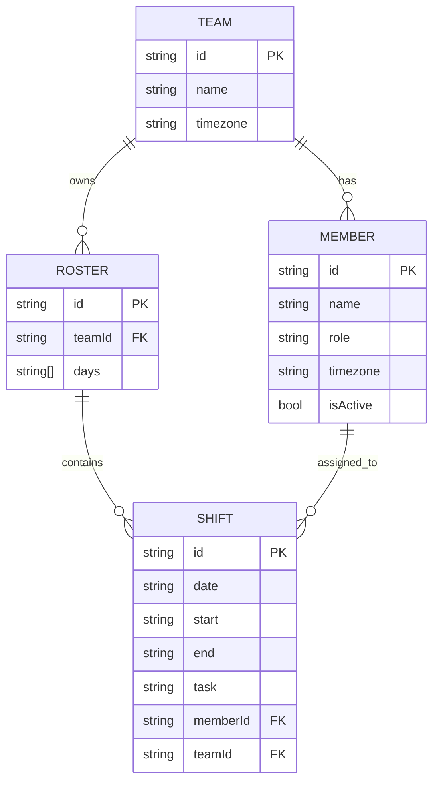
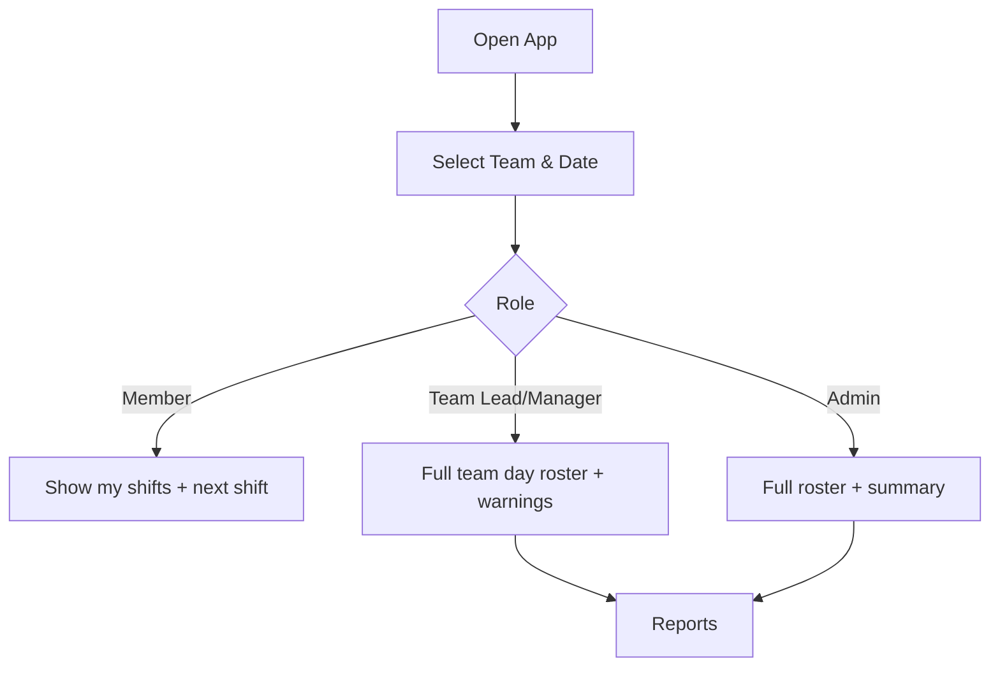

# Rota Viewer

A lightweight Angular app to visualise **daily team rosters** from JSON with **timezone-aware** times, **role-based** views, and **management reports** — all client-side.

---

## 🚀 Quickstart

Clone the repo and install dependencies:

```bash
npm ci
ng serve -o
````

Build for production:

```bash
ng build
```

Run tests:

```bash
ng test
# (with coverage)
ng test --code-coverage
```

---

## ✨ Features

* 📅 **Daily roster** (read-only) from `assets/data.json`
* 🔄 **Team/date switching** and **timezone conversion** (via Luxon)
* 📊 **Reports**: allocation, coverage %, fairness (σ) with clean charts
* 👥 **Roles**: member, team lead, manager, admin
* ♿ **Accessible**, **responsive** UI (Angular Material)
* ✅ **Test suite** for services, metrics, and smoke tests for components

---

## 📂 Project Structure

```
src/app/
  core/services/     # Data, timezone, role services
  features/roster/   # Daily roster view
  features/reports/  # Reports page (KPIs + charts)
  models.ts          # Entities and interfaces
src/assets/data.json # Sample dataset
```

## 🛠️ Design

### Entity Relationship Diagram



### Role Flow



---

## 📊 Tech Stack

* **Angular** (standalone components)
* **Angular Material** for UI
* **Chart.js + ng2-charts** for reports
* **Luxon** for timezone conversion
* **RxJS** for state & observables

---

## ♿ Accessibility & Responsiveness

* Keyboard-friendly navigation
* ARIA labels for interactive elements
* Adequate contrast and visible focus states
* Responsive layout (mobile → desktop)

---

## ⚠️ Limitations & Future Work

* Editing rosters (currently read-only)
* Multi-week grid view
* CSV/PDF export
* Authentication & user persistence
* Internationalisation (i18n)

